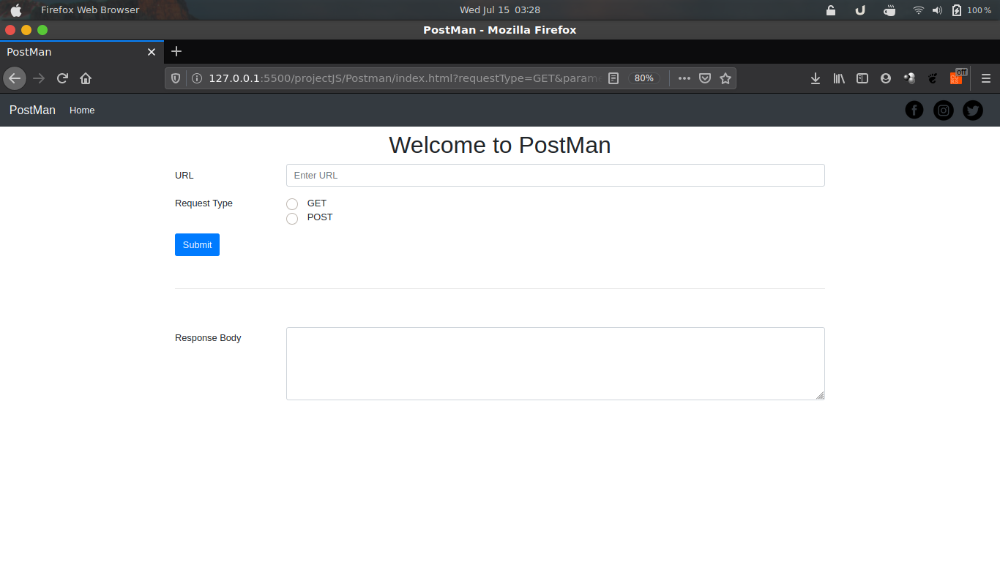
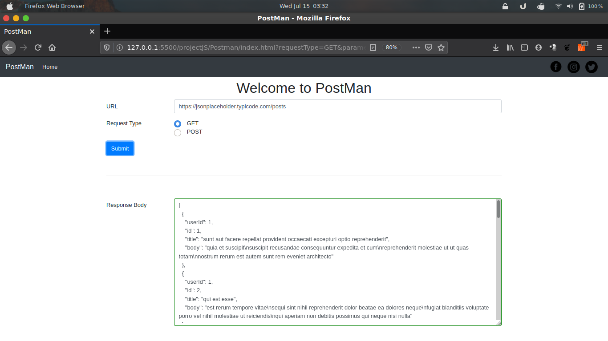
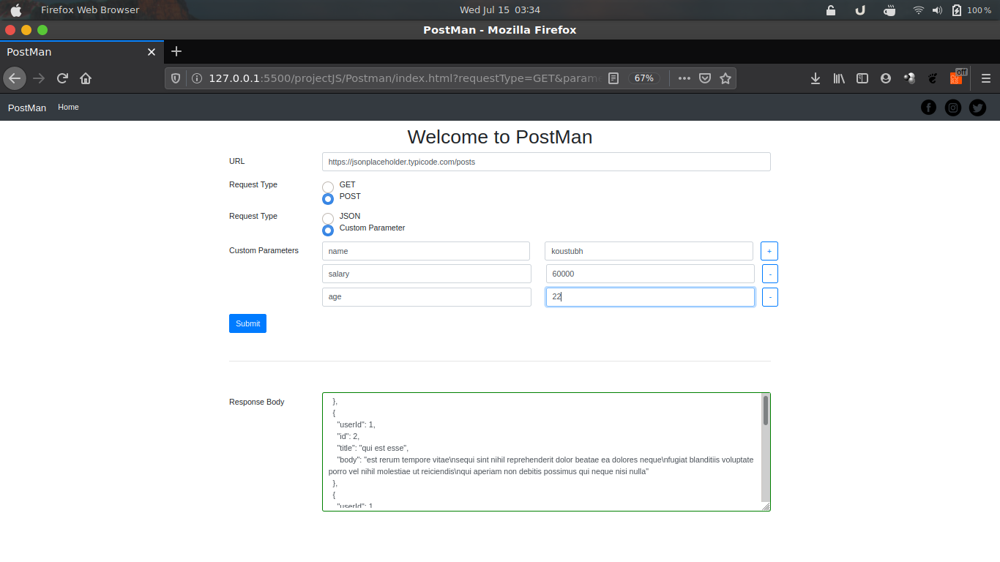
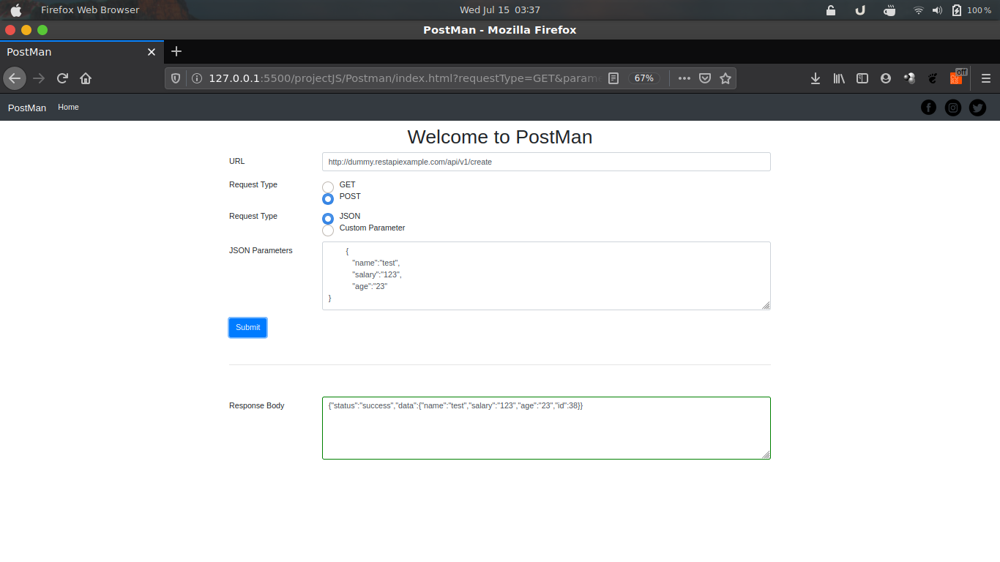

# POSTMAN
 This is replica of the well known app for testing API's i.e. Postman.This is very lite version of the app.
 This web app can trigger following requests:
 - GET
 - POST

 It can also send the request parameter as Custom Parameters and JSON Parameters

---

**Why This PostMan webapp ?**

- Zero installations ,Its just requires a browser
- If want to do small API testing

---

### How to run this PostMan ?

- First clone this repo by typing git clone or by simplying downloading it
- double click on the index.html file to run in your default browser 
---

### Implementation Of NewsAPI
- **Home Page of the Webapp**
- 
- **Performing GET request from app**
- 
- **Performing POST request with custom parameters from app**
- 
- **Performing POST request with JSON parameters from app**
- 

---
### Technology Used
- HTML
- Css
- Javascript
- Bootstrap Library

## FAQ

- **Is this really working?**
    - Yes,it internally make a http request with the help of fetch api function in vanilla JS.

---

## Contact Us

Fell free to contact me for further suggestion!

- Email :     <a href="koustubhmishra91@gmail.com" target="_blank">`koustubhmishra91@gmail.com`</a>
- Instagram:  <a href="https://www.instagram.com/koustubh_mishra/?r=nametag" target="_blank">koustubh_mishra</a>

## Reviews

- Zlite147 : Good Implementation Of JS  
---
